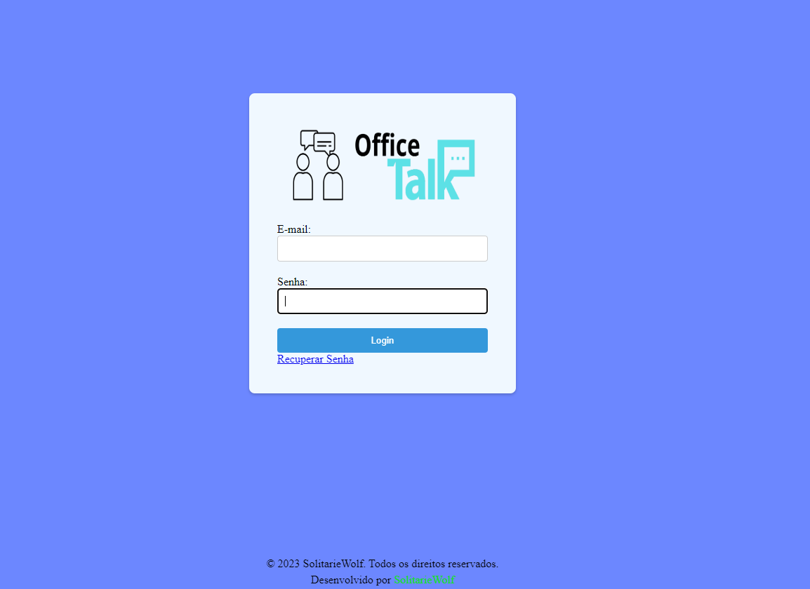

<!-- Insira um banner com o nome do projeto, usando emojis e cores -->
<h1 align="center">
  🏢 OfficeTalk - Aplicativo de Comunicação Corporativa 🌐
</h1>

  

<!-- Adicione um badge para a versão beta e o status do projeto -->

  
  

## ℹ️ Sobre o Projeto

OfficeTalk é um aplicativo web responsivo desenvolvido para empresas permitirem a comunicação interna entre seus funcionários. Ele oferece uma plataforma segura e fácil de usar, projetada especificamente para facilitar a colaboração e a troca de mensagens entre equipes.

## ⭐ Recursos Principais

- **🔒 Autenticação de Usuários**: Implementamos um sistema de autenticação seguro para garantir que apenas os funcionários autorizados tenham acesso ao chat. Os usuários podem fazer login usando suas credenciais corporativas.

- **🗨️ Salas de Chat**: Criamos salas de chat para que os funcionários possam se comunicar em grupos específicos, como departamentos, equipes de projeto ou canais temáticos. Isso facilita a organização das conversas e o direcionamento das mensagens para as pessoas certas.

- **⚡ Mensagens em Tempo Real**: Utilizamos tecnologias de comunicação em tempo real, como WebSockets, para garantir que as mensagens sejam entregues instantaneamente aos destinatários. Os usuários podem participar de conversas dinâmicas e acompanhar as discussões em tempo real.

- **🔔 Notificações**: Implementamos um sistema de notificações para manter os usuários atualizados sobre novas mensagens, menções ou atividades relevantes no chat. Isso garante que nenhuma mensagem importante seja perdida.

- **📧 Mensagens Privadas**: Permitimos que os usuários enviem mensagens privadas uns aos outros para facilitar a comunicação direta entre colegas de trabalho. Isso promove interações individuais e confidenciais dentro da plataforma.

- **📎 Anexos e Compartilhamento de Arquivos**: Adicionamos a funcionalidade de enviar e compartilhar arquivos, como documentos, imagens ou vídeos, dentro do chat. Isso permite que os usuários compartilhem informações importantes e colaborem de forma eficiente.

- **🔍 Pesquisa de Mensagens**: Implementamos uma função de pesquisa que permite aos usuários encontrar rapidamente mensagens antigas dentro do histórico de conversas. Isso facilita a recuperação de informações e a referência a conversas anteriores.

- **👨‍💼 Administração e Moderação**: Desenvolvemos recursos de administração e moderação para que os administradores possam gerenciar usuários, definir permissões e manter um ambiente seguro e adequado no chat. Isso inclui recursos para adicionar e remover usuários, definir políticas de uso e gerenciar as salas de chat.

- **🔒 Segurança e Criptografia**: Priorizamos a segurança dos dados implementando recursos de criptografia para proteger as informações sensíveis que são compartilhadas no chat. Isso garante que as conversas sejam confidenciais e protegidas contra acesso não autorizado.

## 📥 Instalação e Uso

1. Clone este repositório: `git clone https://github.com/seu-usuario/officetalk.git`
2. Instale as dependências: `npm install`
3. Execute o aplicativo: `npm start`
4. Acesse o aplicativo em seu navegador: `http://localhost:3000`

## 🤝 Contribuição

Contribuições são bem-vindas! Sinta-se à vontade para abrir uma issue ou enviar um pull request. Juntos, podemos melhorar o OfficeTalk e torná-lo ainda mais incrível.

## 📢 Feedback

Este projeto está em versão beta e em desenvolvimento ativo. Valorizamos muito o seu feedback. Se você encontrar algum problema, tiver alguma sugestão ou quiser compartilhar sua experiência, por favor, abra uma issue ou entre em contato conosco por e-mail.

## 📄 Licença

Este projeto está licenciado sob a [Licença MIT](LICENSE).

